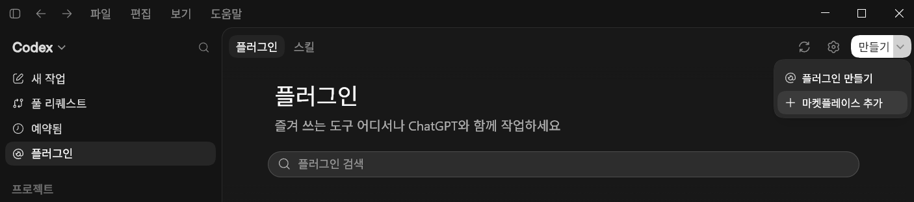
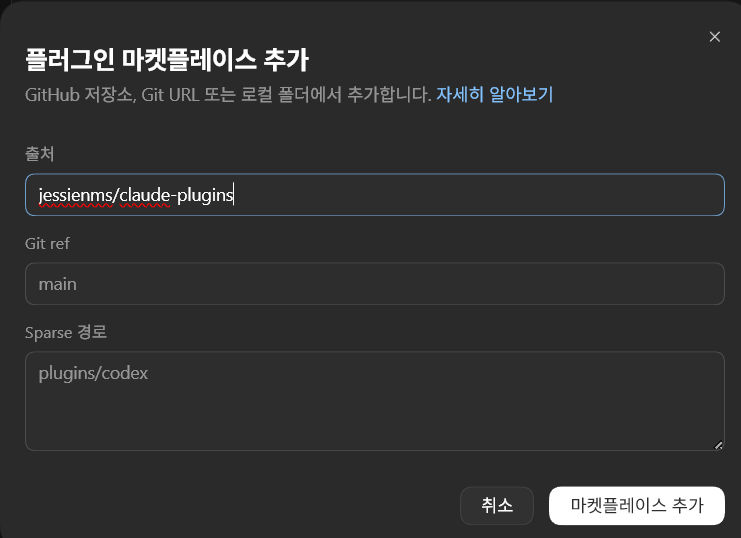

# codex-plugins

[jessienms](https://github.com/jessienms)의 Codex CLI 플러그인 마켓플레이스입니다.

설치 방법은 두 가지입니다. **Codex 앱 화면에서 클릭으로 하는 방법(A)** 과 **터미널 명령으로 하는 방법(B)** 중 편한 쪽을 쓰세요. 결과는 같습니다.

---

## A. Codex 앱에서 설치하기

명령어를 쓰지 않고 화면에서 클릭만으로 설치하는 방법입니다.

### 1단계. 마켓플레이스 추가

왼쪽 사이드바에서 **플러그인** 을 연 뒤, 오른쪽 위 **만들기 ▾** → **마켓플레이스 추가** 를 클릭합니다.



### 2단계. 저장소 입력

다이얼로그가 열리면 **출처** 칸에만 아래를 입력하고 **마켓플레이스 추가** 를 누릅니다.

```
jessienms/claude-plugins
```



> ⚠️ **Git ref 와 Sparse 경로는 비워 두세요.**
> 두 칸에 흐리게 보이는 `main` 과 `plugins/codex` 는 입력값이 아니라 **예시(placeholder)** 입니다.
> 그대로 따라 입력하면 마켓을 찾지 못합니다. 이 레포의 마켓 정의는 저장소 루트의
> `.agents/plugins/marketplace.json` 에 있으므로 Sparse 경로가 필요 없고, 기본 브랜치가
> `main` 이라 Git ref 도 비워 두면 됩니다.

### 3단계. 플러그인 설치

마켓이 추가되면 **플러그인** 화면의 검색창에서 플러그인 이름(예: `google-chat-send`)을 찾아 설치합니다.

설치 후 **새 Codex 스레드**를 시작하면 스킬이 로드됩니다.

---

## B. 터미널에서 설치하기

명령은 TUI 슬래시 명령이 아니라 터미널의 `codex` 서브커맨드입니다.

```bash
# 1) 마켓플레이스 추가 (레포 루트의 .agents/plugins/marketplace.json 을 읽습니다)
codex plugin marketplace add jessienms/claude-plugins

# 2) 플러그인 설치 — 마켓 이름(jessienms-codex-plugins)을 붙입니다
codex plugin add google-chat-send@jessienms-codex-plugins
codex plugin add csharp-solid-principles@jessienms-codex-plugins
```

확인 명령:

```bash
codex plugin marketplace list   # 등록된 마켓
codex plugin list               # 설치된 플러그인
```

특정 브랜치/태그로 고정하려면 `codex plugin marketplace add jessienms/claude-plugins --ref main` 처럼 `--ref` 를 붙입니다.

설치 후 **새 Codex 스레드**를 시작하면 스킬·도구가 로드됩니다. TUI 안에서는 `/plugins` 브라우저로도 설치·토글할 수 있습니다.

---

## 플러그인

| 플러그인 | 설명 |
|----------|------|
| [csharp-solid-principles](plugins/csharp-solid-principles/README.md) | C# 예제로 SOLID 원칙(SRP/OCP/LSP/ISP/DIP)을 점검하는 체크리스트 스킬 — 원칙별 위반 예시·리팩터링·감지 패턴 (한국어) |
| [google-chat-send](plugins/google-chat-send/README.md) | 팀 Google Chat Space로 메시지·알림 전송 — 용도별 named webhook, 중복 전송 방지, webhook 비밀 보호 |

## 라이선스

MIT
